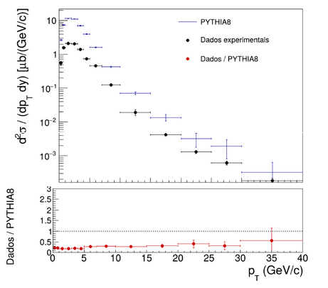

# Study of J/ψ Production in pp Collisions at √s = 13 TeV

This repository contains a Monte Carlo simulation of J/ψ production in proton–proton collisions at √s = 13 TeV using **Pythia8**, with analysis performed using **ROOT**.

The project was developed as part of an undergraduate research project (PIBIC) in Physical Engineering at UNICAMP.

The simulation generates events, reconstructs J/ψ mesons, separates prompt and non-prompt contributions, and compares the resulting transverse momentum distribution with experimental data.

---

# Physics Motivation

The J/ψ meson is a bound state of a charm quark and an anti-charm quark (c\bar{c}).
Studying its production in high-energy proton–proton collisions provides insight into:

* Quantum Chromodynamics (QCD)
* Heavy quark production mechanisms
* Contributions from B-hadron decays
* The interplay between perturbative and non-perturbative QCD effects

In this project, the differential cross section as a function of transverse momentum is studied and compared with experimental measurements.

---

# Simulation Setup

Events are generated using **Pythia8** with the following configuration:

* Proton–proton collisions
* Center-of-mass energy: √s = 13 TeV
* Charmonium production enabled
* SoftQCD non-diffractive processes
* Multiple Parton Interactions (MPI)
* Initial State Radiation (ISR)
* Final State Radiation (FSR)

J/ψ particles are selected within the rapidity region:

|y| < 0.9

---

# Analysis Performed

The analysis pipeline performs the following steps:

1. Generate Monte Carlo events using Pythia8
2. Loop over particles in each event
3. Identify J/ψ mesons (PDG ID = 443)
4. Determine whether the particle originates from B-hadron decay
5. Separate contributions into:

   * prompt J/ψ
   * non-prompt J/ψ
6. Fill transverse momentum histograms
7. Normalize the distributions to obtain

d²σ / (dpT dy)

8. Compare the simulated result with experimental data
9. Compute the ratio:

Data / Pythia8

---

# Repository Structure

Relatorioparcial.cc
Main C++ simulation and analysis code.

Makefile
Compilation instructions for building the executable.

jpsi_alice_style_ratio.png
Example output comparing simulation results with experimental data.

---

# Example Result

The plot shows:

* Differential cross section as a function of transverse momentum
* Experimental data points
* Monte Carlo prediction from Pythia8
* Ratio between data and simulation

---

# Requirements

To run the code you need:

* Linux environment
* C++ compiler (g++)
* Pythia8 installed
* ROOT installed

---

# Compilation

The project uses a Makefile.

To compile the code run:

make

This will generate the executable:

relatorioparcial

The Makefile automatically uses:

* root-config
* pythia8-config

to include the correct compiler and linker flags.

---

# Running the Simulation

Run the program with:

./relatorioparcial

The program will generate events, perform the analysis and produce the output files.

---

# Output Files

jpsi_output.root
ROOT file containing the generated histograms.

jpsi_alice_style_ratio.png
Plot comparing experimental data with the Pythia8 simulation.

---

# Author

Gustavo Sobreira Barroso
Undergraduate Student – Physical Engineering
UNICAMP

